# From a picture to a moving line drawing: how diffy-art works

This document walks through every stage of the transformation pipeline using the pictures and numbers the program recorded while it ran. Every image below comes from one real run on one input image.

---

## Before and after

The input is a small, ordinary 225 × 225 pixel JPEG:

*The sample artwork bundled with the project.*

The output is a 450 × 450, 140-frame animated GIF that loops seamlessly every 7 seconds:

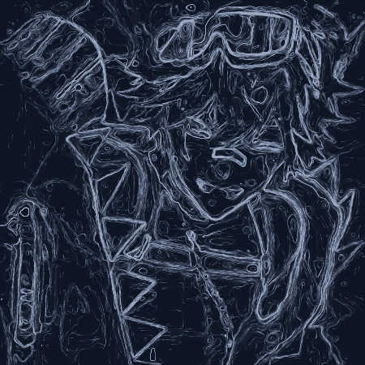

Nothing in the output was traced by hand, and the program never "detects outlines" in the usual sense. It turns the picture into a set of **directions** (at every point, which way the image's lines run), then lets thousands of tiny ink-dropping markers slide along those directions. The drawing appears because the paths the markers follow happen to hug the shapes in the picture.

---

## The core idea in one paragraph

Think of a topographic map. Contour lines join points at the same height, and if you walk along one you never go uphill or downhill. Now replace height with **lightness**: a dark jacket is a valley, a pale face is a plateau, and the boundary between them is a steep slope. If you walk along that slope at constant lightness, you trace the boundary. The transformation pipeline computes, at every pixel, the direction that keeps you at constant lightness and colour. That map of directions is a *field*, and the paths you get by following it are its *solution curves*. The whole pipeline is: build the field carefully, follow it accurately, and render the result as ink that fades over time so it looks both drawn and alive.

---

## The settings used for this specific run

These values come from `measurements.json`, which the program writes alongside its results so any run can be reproduced. A few were changed from the defaults, and they explain some of what you'll see.

| Setting | This run | Default | What it controls |
|---|---|---|---|
| Source image | 225 × 225 | (any) | The input picture |
| Upsample | **16×** | 4× | Size of the internal working canvas (here 3600 × 3600) |
| σ (sigma) | 0.45 source px | 0.45 | How much blurring happens before measuring edges |
| κ (kappa) | 2.4 | 2.2 | How much extra weight colour edges get compared to lightness edges |
| Threshold quantile | **0.01** | 0.45 | How weak an edge may be before markers are forbidden there |
| Markers | 14,000 | 14,000 | Number of ink-dropping particles |
| Speed | **10** working px/frame | 5.5 | How fast markers slide |
| Slow / fast memory (τ_s / τ_f) | 120 / 3 frames | 120 / 3 | How long ink lingers in each of two layers |
| Frames | 140 (280 simulated + 260 warm-up) | 140 | Loop length |

The very low threshold (0.01) is worth remembering: it lets markers wander almost everywhere, including quiet background areas, which is why the final drawing has faint squiggles in the dark regions as well as bold outlines. This was a personal choice as I personally enjoy the more meandry style as it makes the other parts seem to pop.

---

## A map of the pipeline

The program's `--trace` option saved one graphic per stage, numbered in the order they ran. This document follows those numbers.

| Part | Trace files | What happens |
|---|---|---|
| 1. Reading the image | 001–003 | Load, enlarge, convert to a colour space that matches human vision |
| 2. Measuring edges | 004–011 | Measure how lightness and colour change, combine into one description per pixel |
| 3. Direction and confidence | 012–014 | Extract the edge direction and how trustworthy it is |
| 4. Where the pattern breaks | 015–017 | Find the special points where directions can't be made consistent |
| 5. Following the lines | (figure) | How a path is actually traced through the field |
| 6. Deciding where ink may go | 018–019 | Rule out meaningless regions, weight where markers are born |
| 7. Releasing the markers | 020 | Place 14,000 markers |
| 8. Ink that fades | 021–025 | Simulate, set exposure, shrink to output size |
| 9. Making a seamless loop | 026–027 | Crossfade so the GIF has no visible jump |
| 10. Colour and GIF | 028–030 | Colour, reduce to 32 colours, write the file |

---

## Part 1 — Reading the image

### 001 · Loading

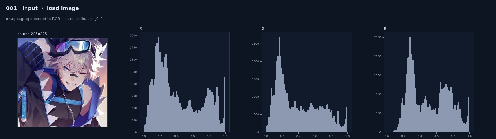

The JPEG is decoded into three numbers per pixel (red, green, blue), each scaled to lie between 0 and 1. The histograms on the right show how often each brightness level occurs in each channel. All three have a tall peak at the dark end (the black clothing and shadowed background) and a broader hump at the bright end (skin, hair and the sunset sky). Nothing is changed at this step; it just records the starting point.

### 002 · Enlarging the canvas 16×

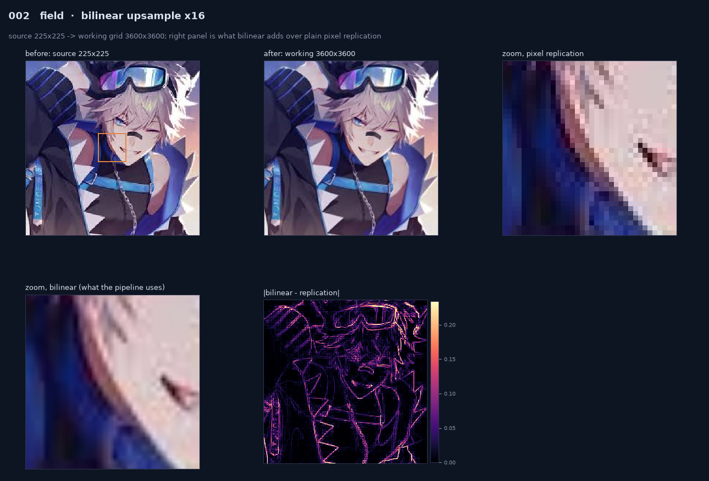

The picture is enlarged from 225 × 225 to 3600 × 3600 pixels. This doesn't add detail that wasn't there, but it gives the markers a much finer surface to draw on. Later, the drawing is shrunk back down by a factor of 8, and that averaging is what makes the final lines smooth instead of jagged (the same trick as rendering a video game at high resolution and scaling it down).

How the enlargement is done matters. The zoomed panels compare two methods on the small orange square near the mouth:

- **Pixel replication** (top right) just makes each pixel into a 16 × 16 block, producing staircase edges.
- **Bilinear interpolation** (bottom left, what the pipeline uses) blends smoothly between neighbouring pixels.

Staircase edges would be a disaster here, because the next steps measure the *direction* of edges, and a staircase has only horizontal and vertical directions. The bottom-right panel shows where the two methods differ: exactly along the edges of the drawing, which is where it counts. About 97% of pixels differ at least slightly, with an average difference of about 2% of full brightness.

### 003 · Switching to a colour space built around human vision

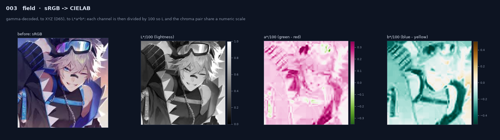

RGB is how screens produce colour, not how people perceive it. The image is converted into **CIELAB**, which splits colour into three independent channels:

- **L\*** (lightness), from black to white. This is essentially a well-calibrated greyscale version of the picture.
- **a\*** runs from green to red/magenta. The image leans pink overall (average +0.12). The strongest values are on the goggles and the saturated blue-violet parts of the jacket, since vivid blues sit on the red side of this axis in CIELAB.
- **b\*** runs from blue to yellow. The blue jacket straps and trim stand out as the dark teal shapes.

Why bother? Some boundaries in this picture are mostly a change of *colour* rather than *lightness*: a saturated blue strap against a dark shirt, for example. Working in CIELAB lets the pipeline notice those boundaries separately and decide how much they should count. The division by 100 simply puts all three channels on a similar numeric scale.

You can also see a faint grid of small squares in the a\* and b\* panels. That's a fingerprint of JPEG compression, which typically stores colour at lower resolution than lightness, in small blocks. It becomes relevant later.

---

## Part 2 — Measuring edges

An edge is a place where the picture changes quickly. To find edges and their directions, the pipeline measures the **gradient**: at every pixel, how fast the channel is changing left-to-right and top-to-bottom. Together those two numbers form a small arrow that points "uphill", toward lighter (or redder, or yellower) values, and whose length says how steep the change is.

### 004 · Slopes of the lightness channel

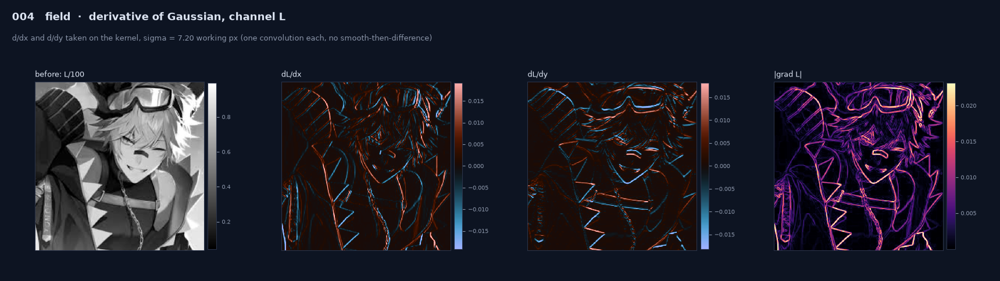

Measuring slope on raw pixels is noisy: every speck of compression noise looks like a tiny cliff. The usual fix is to blur first, then measure. The transformation pipeline does both in a single operation called a **derivative of Gaussian**: it slides a smooth, bell-shaped "measuring window" across the image that reports the slope of the blurred picture directly. This is mathematically cleaner than blurring and then differencing, and σ (the width of that bell) acts as a **scale selector**. A small σ picks up fine texture like individual hair strands; a large σ picks up broad shapes like the silhouette.

Here σ is 7.2 working pixels (0.45 original pixels × 16).

The panels show:

- **dL/dx**: left-to-right change. Red means getting lighter to the right, blue means getting darker. Vertical edges light up; horizontal edges vanish.
- **dL/dy**: top-to-bottom change. Now horizontal edges light up (see the goggle strap and the chest strap).
- **|grad L|**: the steepness regardless of direction. It already looks like an outline drawing, but it's only telling us *where* edges are. The pipeline needs *which way they run* too.

### 005 · Starting the structure tensor

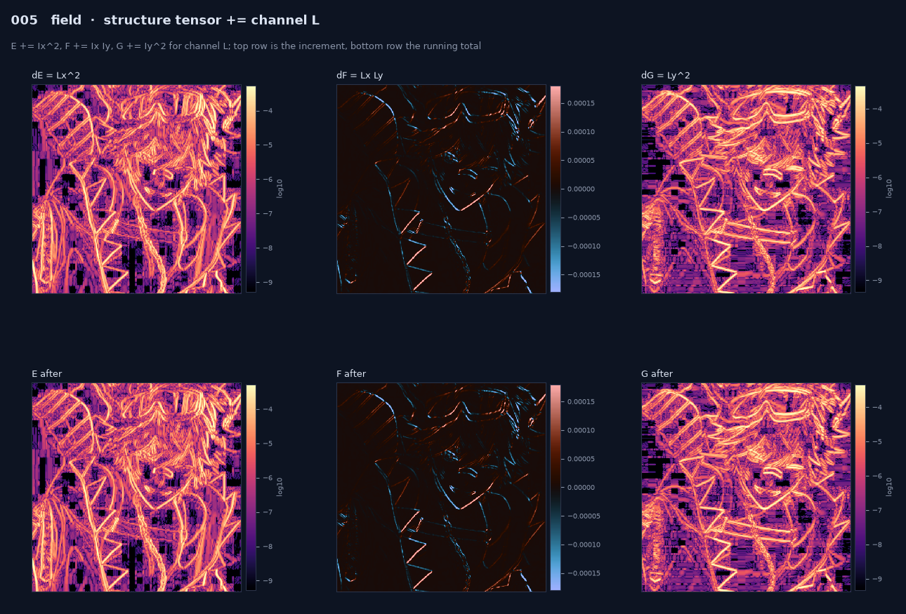

Here's a subtle problem. We want to combine slopes from three channels (L, a, b) into one direction per pixel. The obvious approach is to add the slope arrows together, but that fails. Imagine a boundary where lightness increases to the right but "yellowness" increases to the left: the arrows point in opposite directions and cancel out, even though both channels agree there's a strong vertical edge.

The fix is to record, for each channel, not the arrow itself but three **products** of its components:

- **E** = (left–right slope)², large where the edge is steep horizontally.
- **G** = (top–bottom slope)², large where the edge is steep vertically.
- **F** = (left–right slope) × (top–bottom slope), positive or negative depending on which diagonal the edge tilts along.

Squaring throws away the difference between "uphill" and "downhill" while keeping the *orientation* of the edge, so opposite arrows now reinforce instead of cancelling. The three numbers (E, F, G) per pixel are called the **structure tensor**. It's simply a compact summary of "how much change is there, and along which axis."

The top row shows what the lightness channel contributes; the bottom row shows the running totals (identical here, since L is the first channel added).

These panels use a logarithmic colour scale that spans six orders of magnitude, so tiny values in flat areas become visible. That's why the backgrounds show blocky rectangles: they're JPEG compression artifacts, magnified. They carry almost no energy, but they do contain "directions", and that will matter in Part 4.

### 006–011 · Adding the colour channels

The same three steps repeat for **a\*** and then **b\***: measure slopes, apply the colour weight, and add to the running total.

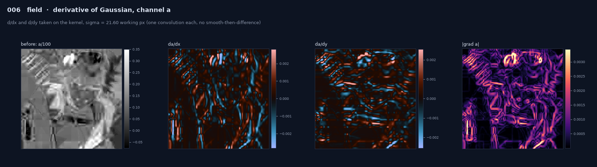

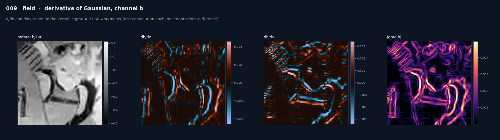

Two things are different for the colour channels. First, their blur is **three times wider** (σ = 21.6 working px), so the colour slopes are smoother and blobbier than the lightness ones. Colour information in a JPEG is coarse to begin with, and a wider blur stops its block structure from dominating. Second, the b\* channel (009) shows very clean, bold shapes: the blue straps curving around the torso and arm.

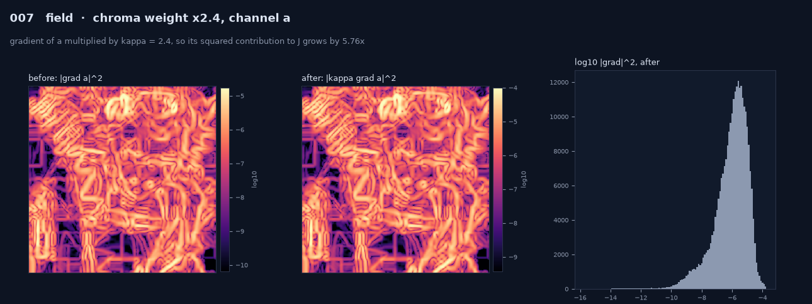

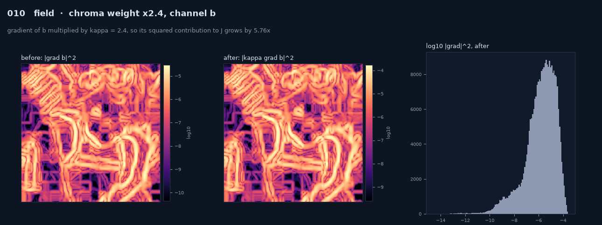

Each colour slope is multiplied by κ = 2.4. Because the structure tensor uses *squared* slopes, this boosts colour's influence by 2.4² = 5.76×. The before/after maps look identical in shape because only the scale changes (note the shifted colour bar). This weight is an artistic choice: without it, colour boundaries would be drowned out by lightness.

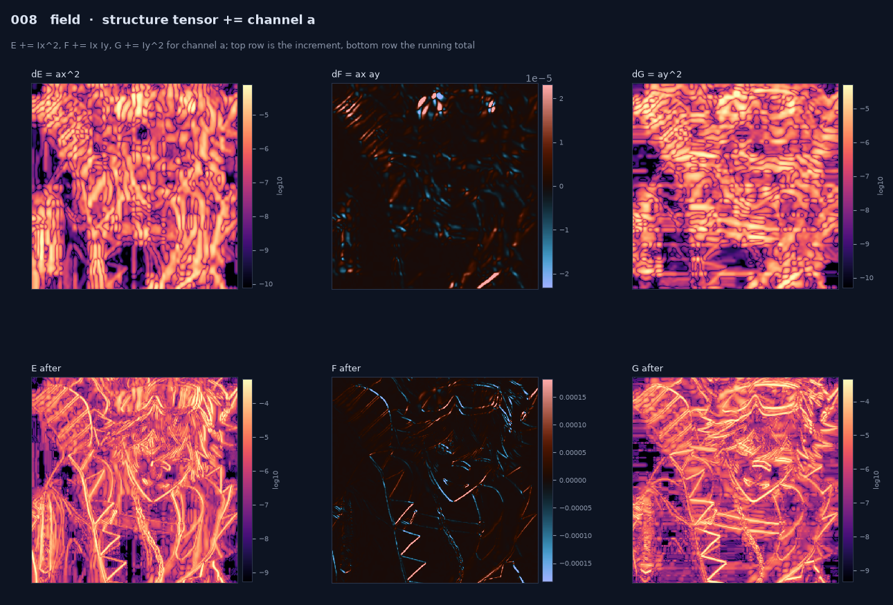

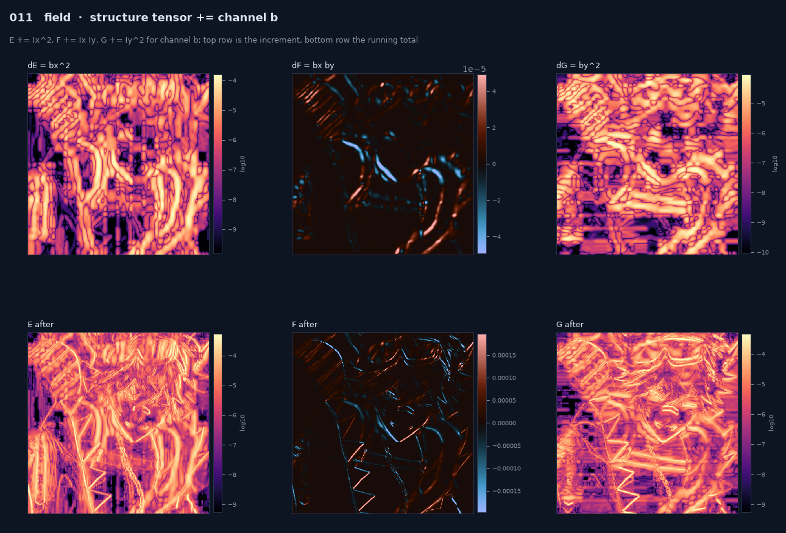

Once all three channels are in, the final structure tensor is complete. The trace records how much each channel added to the total. Working it through, the final mix is roughly **63% lightness, 11% green–red and 26% blue–yellow**. The blue–yellow channel pulls its weight because of all that blue trim. Compare the "E after" panel in 011 with the one in 005: the strap shapes from b\* are now layered on top of the fine lightness detail.

---

## Part 3 — Direction and confidence

### 012 · Splitting each pixel into "strong" and "weak" directions

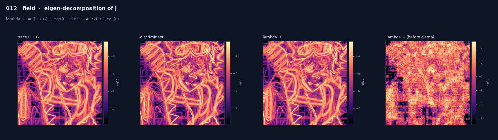

At every pixel, the three numbers E, F, G can be reorganised into two perpendicular directions and a strength for each. (Mathematically this is an eigen-decomposition of a 2 × 2 matrix; there's a direct formula, so it's cheap.)

- **λ₊** (lambda-plus) is the strength of change along the *strongest* direction, across the edge.
- **λ₋** (lambda-minus) is the strength along the perpendicular direction, along the edge.

For a clean edge, λ₊ is large and λ₋ is nearly zero: things change a lot across the edge and not at all along it. For a flat patch, both are near zero. For a noisy, textured patch, both are similar, because change happens in every direction.

The first three panels (the trace E+G, the discriminant, and λ₊) look nearly identical, which tells you something useful: λ₋ is tiny almost everywhere. On average, λ₋ is about 28 times smaller than λ₊, so most of this image is made of clear, one-directional edges. The fourth panel, λ₋ on its own, looks like noise, because it measures disagreement between directions, which is mostly compression noise.

### 013 · A safety clamp that wasn't needed

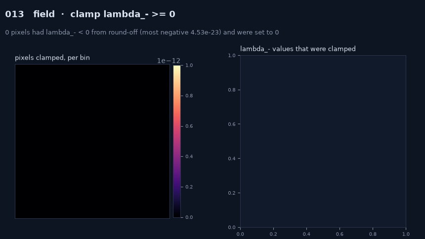

In theory λ₋ can never be negative, but tiny rounding errors in computer arithmetic can occasionally produce values like −0.0000000000001. This step would reset any such values to zero. In this run, **no pixel needed it**, so both panels are empty. (The caption's "most negative" value of 4.53e-23 is actually the smallest value found, and it's positive.) The step is kept in the trace because a stage that could have changed something is worth confirming.

### 014 · The line field and its coherence

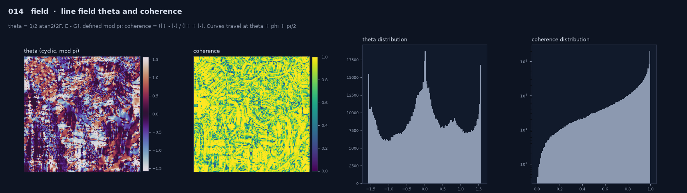

This is the heart of the pipeline. Two maps come out of it:

**θ (theta)** is the angle of the strongest direction at each pixel. The drawing lines will run *perpendicular* to it, i.e. along the edges, like walking along a contour line rather than straight up the hill.

The key subtlety is that θ describes a **line**, not an arrow. A line at 10° and a line at 190° are the same line; it has no "forward" end. That's why θ only ranges over 180° (from −90° to +90°), and why the colour map is cyclic: −90° and +90° are both white, because they're the same orientation. Such a field of headless directions is called a **line field**.

This has a practical consequence the code is very careful about. Suppose you need the direction halfway between two pixels, one at +89° and one at −89°. Those lines are almost identical (both nearly vertical), but naively averaging the numbers gives 0°, which is horizontal and completely wrong. So the program never averages angles. Instead it stores the direction as a pair of numbers built from *double* the angle (effectively E − G and 2F), in which +89° and −89° come out almost the same. It averages those, and only converts back to an angle at the last moment. It's like taking a clock where 12 and 6 mean the same thing and spinning the hand twice as fast, so 12 and 6 land on the same spot.

The θ histogram shows peaks at 0° and at ±90° (which, remember, are the same orientation). Horizontal and vertical directions are over-represented, which is typical when a pixel grid and JPEG blocks leave their mark on the flat areas.

**Coherence** measures how trustworthy the direction is: (λ₊ − λ₋) / (λ₊ + λ₋). A value of 1 means a perfectly clean, one-directional edge; 0 means no preferred direction at all. The average here is 0.85, and the histogram piles up hard against 1, which confirms what step 012 suggested: most of the image has a well-defined direction.

---

## Part 4 — Where the pattern breaks: singularities

A line field has a surprising property. Try this: pick a small loop, walk around it, and keep track of how the local line direction turns as you go. When you get back to where you started, the direction must match what it was, but for a **line** "matching" includes having turned by exactly half a revolution, since a line flipped end over end is the same line.

So if you add up the total turning around a small loop you can get 0 (nothing special inside), or **+½ turn** or **−½ turn**. A loop with a non-zero total must contain a point where the direction is undefined: a **singularity** (or defect).

The two kinds of singularities look different:

- **+½, a "wedge"**: lines bend around the point like a U, or like the loop in a fingerprint.
- **−½, a "trisector"**: three families of lines meet, like the triangular gap where three fingerprint ridges come together.

These half-turn defects *cannot* occur in an ordinary field of arrows, like the slope arrows from Part 2, where only whole turns are possible. They exist only because the pipeline deliberately treats directions as headless lines. They're the places where families of curves split, merge and reorganise, and I credit them with a large part of why the output reads as hand-drawn rather than machine-traced.

### 015 · Checking every small loop

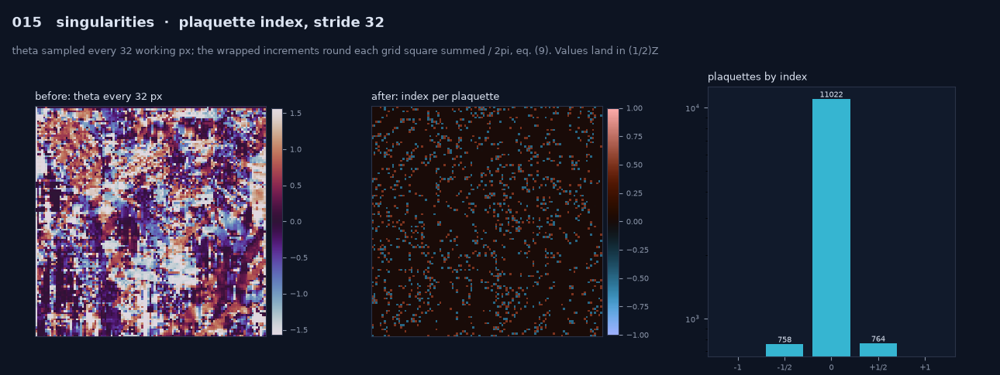

The program samples θ every 32 working pixels (every 2 original pixels) and, for each little square of four neighbouring samples, adds up the turning around its edges. Between neighbours it always assumes the *smaller* turn, never more than 90° either way. Dividing by a full turn gives the square's **index**.

The results (right) are exactly as theory predicts: of 12,544 squares, 11,022 have index 0, **764 have +½, 758 have −½, and none have ±1**. The middle panel shows where they are: scattered dots, red for +½ and blue for −½.

### 016 · Merging neighbours into individual defects

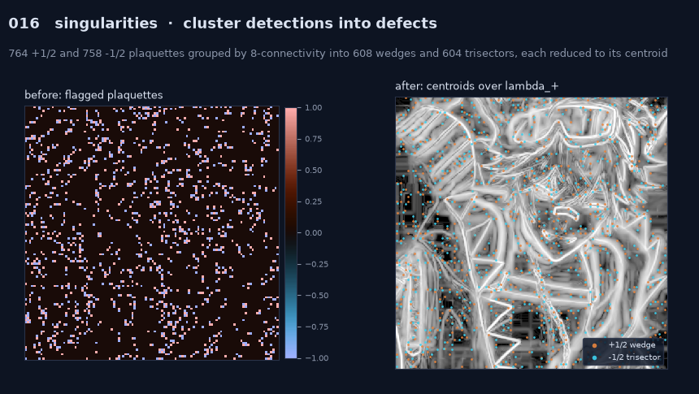

A single defect sitting near a corner can be flagged by two or three adjacent squares. So neighbouring squares with the same sign are grouped and replaced by their centre point. That leaves **608 wedges and 604 trisectors**, shown on the right as orange (wedges) and cyan (trisectors) dots over the edge-strength map.

The near-perfect balance (a difference of only 4) isn't a coincidence. Small wiggles in a field tend to create defects in +½/−½ pairs, a little like positive and negative charges, and only the image border lets the totals drift apart slightly.

### 017 · How honest is that count?

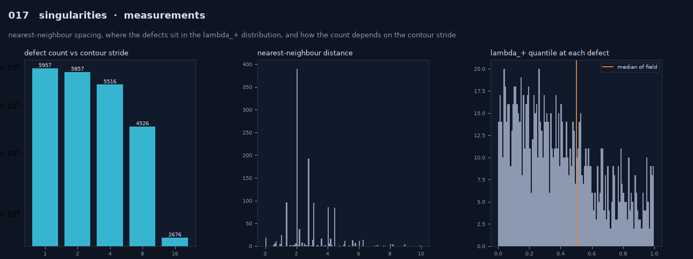

This stage examines its own result critically.

**Left: count versus loop size.** An index belongs to a *loop*, not a point, so the number of defects you find depends on how big your loops are. Using squares 1 working pixel wide finds 5,957 defects; 16 pixels finds 2,676; the 32 pixels used above found 1,212. Smaller loops catch tiny noise defects that bigger loops average away. The pipeline reports this sweep on every run rather than presenting one number as the truth.

**Middle: distance to the nearest other defect.** The spikes at 2, about 2.8 and 4 original pixels aren't a property of the image; they're the checking grid showing through. Squares are 2 pixels apart, so neighbours land side by side (2), diagonally (2√2 ≈ 2.83), or two steps away (4). The median spacing is 2.4 pixels, so defects are densely packed.

**Right: how strong the edges are where defects sit.** If defects were spread evenly, this histogram would be flat around the orange "median" line. Instead it leans left: **67% of defects are in the weaker half of the image**. Defects live mainly in quiet, low-contrast regions (the compression-noise backgrounds seen in Part 2), not on the bold outlines. That's why the strong strokes in the final drawing look clean while the backgrounds swirl.

---

## Part 5 — Following the lines

This figure isn't a numbered trace stage, but it's the clearest picture of what the field *is* and what following it produces.

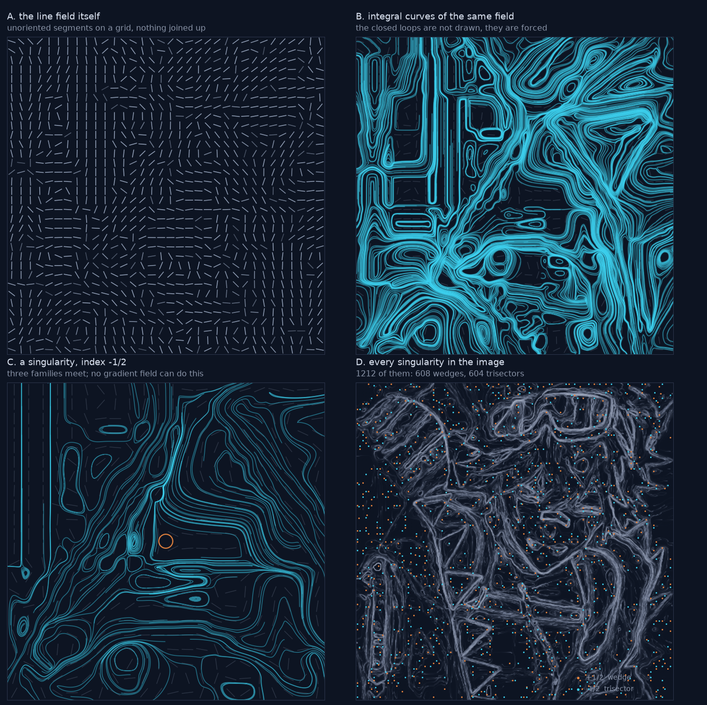

**Panel A** shows the raw line field on a coarse grid over a small window (30% of the image): just short unconnected segments, each pointing along the local edge direction. There's no curve in this data, only local directions.

**Panel B** shows the *same window* after starting a few hundred paths and following the directions. Long flowing curves, closed loops, and bundles appear. The caption's point is important: **nobody drew those loops**. They emerge purely because the directions vary smoothly. Panel B contains no information that Panel A doesn't; following the field just makes it visible.

**Panel C** zooms in on one −½ trisector (the orange circle). You can see three families of curves approaching the point from different sides and turning away, never crossing it. This is the "three fingerprint ridges" pattern from Part 4.

**Panel D** marks all 1,212 defects over the final drawing. As step 017 predicted, the dots cluster in the dark background and avoid the bright strokes.

### How a path is actually traced

A path is built by taking many small steps. The simplest method would be: look at the direction here, step that way, repeat. That's called Euler's method, and it has a flaw. On a circular path it always steps slightly *outside* the circle, because it moves along the tangent, so paths slowly spiral outward. The pipeline's built-in checks measured this drift at 0.037 for Euler and 0.000000055 for the method actually used.

That method is the **midpoint rule**: look at the direction here, take a *trial* half-step, look at the direction *there*, then go back and take the full step from the starting point using that midpoint direction. It costs two direction lookups per step instead of one, and it corrects most of the bending error.

There's also the headless-line problem again. At every step the field says "the line goes this way **or** the opposite way". The tracer always picks whichever of the two is closer to the direction of its previous step, so a path never suddenly reverses on itself. The program also never uses a "slope" description like "rise over run", because that becomes infinite wherever a line is vertical, while an angle-based direction is fine everywhere.

In this run, markers move 10 working pixels per frame, split into 10 midpoint steps of 1 pixel each.

---

## Part 6 — Deciding where ink may go

### 018 · The threshold gate

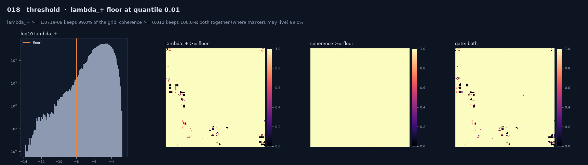

Directions in completely flat areas are meaningless: they're the direction of rounding noise. Two tests decide where markers are allowed to exist:

1. **Edge strength** λ₊ must be above a floor. The floor is set as a *quantile*: here 0.01, meaning "exclude the weakest 1% of pixels". The histogram shows why a quantile is used rather than a fixed number: edge strength spans about eleven orders of magnitude (from 10⁻¹⁴ to 10⁻³), and the right cut-off depends entirely on the image.
2. **Coherence** must be at least 0.012, which rules out only pixels with essentially no preferred direction.

With these settings, the edge-strength test keeps 99.0% of the canvas, the coherence test keeps practically 100%, and together they allow markers on 99.0% of it. The small black specks in the maps are the flattest patches (mostly in the dark clothing on the left and the lower-right corner). A marker that wanders into a black area is removed and reborn elsewhere.

At the default threshold of 0.45, nearly half the canvas would be off-limits and the drawing would be cleaner and sparser. This run chose to keep almost everything for more of a rugged look.

### 019 · Where markers are born

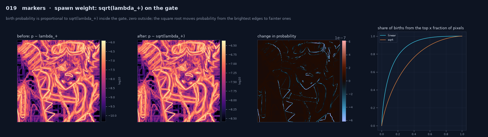

Markers aren't placed uniformly. The chance of a marker being born at a pixel is proportional to the **square root** of that pixel's edge strength. The obvious alternative, proportional to the edge strength itself, would pack almost all markers onto the few boldest strokes.

The rightmost chart makes the difference concrete. It shows what share of births would come from the brightest x% of pixels. Under the plain weighting (blue), the top 1% of pixels would get **14.4%** of all births; with the square root (orange) they get **5.3%**. The "change in probability" panel shows the redistribution: blue (probability removed) along the strongest outlines, with that probability spread thinly over fainter edges. The result is a drawing with a range of line weights rather than a few overbright contours.

---

## Part 7 — Releasing the markers

### 020 · 14,000 markers

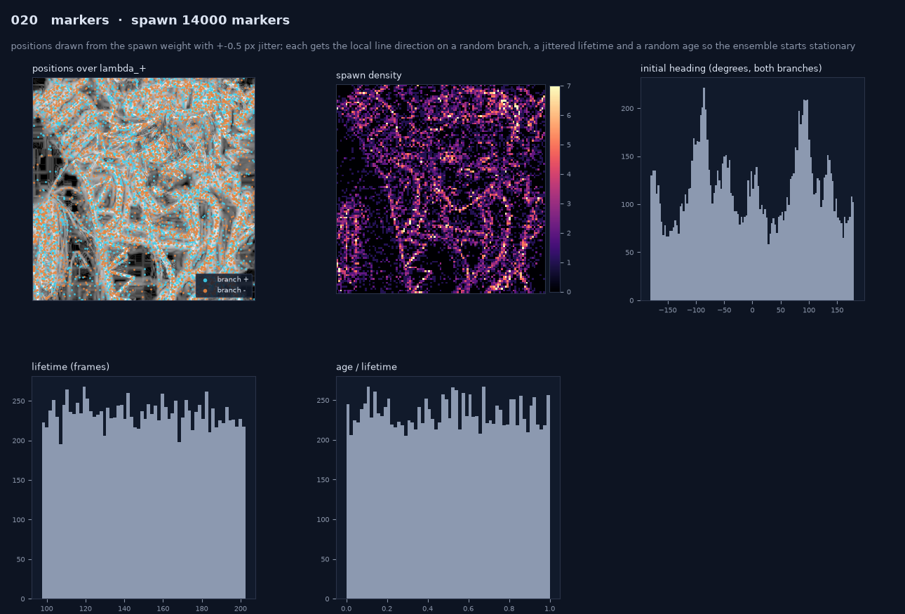

Each marker gets four things:

- **A position**, drawn from the birth weighting, plus a random nudge of up to half a pixel so markers don't sit exactly on pixel centres. The *spawn density* panel shows them concentrated along the image's edges.
- **A heading** along the local line. Since the line has no preferred end, a coin flip decides which way: 7,042 of the 14,000 (about half) were flipped. The top-left panel colours the two groups cyan and orange, and they're thoroughly mixed. The heading histogram has two peaks roughly 180° apart, the same line travelled in both directions.
- **A lifetime** between about 98 and 202 frames (150 ± 35%), after which the marker is retired and a new one is born. Constant turnover keeps markers from piling up in the same loops forever, and it keeps the drawing statistically steady over time.
- **A starting age**, chosen at random within its lifetime. The flat "age / lifetime" histogram is the point: if every marker started at age 0, they would all expire around the same moment, causing a visible wave of rebirths. Staggered ages make the ensemble look as if it had been running forever.

---

## Part 8 — Ink that fades

### How the rendering works

Each frame, every marker takes its 10 small steps and drops a dab of ink at each one: 14,000 × 10 = **140,000 dabs per frame**. Each dab is shared among the four nearest pixels, in proportion to how close it is to each, so ink lands smoothly rather than in hard pixel dots.

The ink goes into **two layers at once**, which fade at very different speeds:

- The **slow layer (B)** keeps 99.2% of its ink each frame (time constant 120 frames). Half the ink is gone after about 83 frames, or roughly 4 seconds at 20 fps. A marker goes round a loop much faster than that, so ink builds up along the whole path into a steady, **drawn line**.
- The **fast layer (C)** keeps only 72% of its ink each frame (time constant 3 frames). Half is gone after about 2 frames. Ink here barely outlives the marker that dropped it, so it shows as a short bright **pulse travelling along the line**.

The displayed image mixes them: 58% of the slow layer plus 42% of the fast layer. The fast layer is multiplied by 40 (the ratio 120 ÷ 3) first, because it holds 40 times less ink at any moment and would otherwise be invisible. That blend is what makes the result look simultaneously drawn and moving.

### 021 · Warm-up: 260 frames that are thrown away

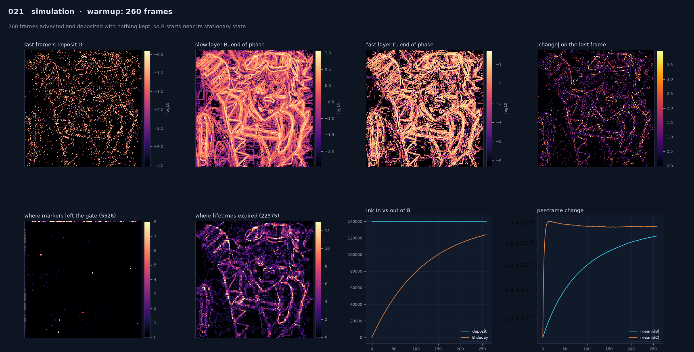

A drawing that starts from a blank canvas takes a while to fill in, so the program runs 260 frames before recording anything. This GIF shows every warm-up frame: the combined buffer on the left, and what changed on that frame on the right.

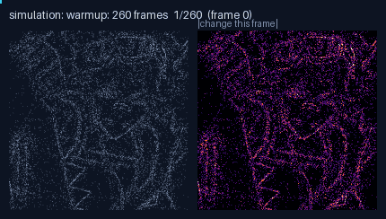

In the first frame there's only faint speckle; by frame 50 the goggles and jacket are clearly recognisable; by frame 260 the drawing is dense and stable.

In the still graphic, the top row shows the final frame's ink dabs, the slow layer, the fast layer, and the change on the last frame. Notice how the slow layer (B) looks like a finished drawing while the fast layer (C) is sparser and spikier.

The bottom row tells the story of the warm-up:

- **Ink in vs. out of B.** Ink added is a flat 140,000 per frame. Ink lost to fading starts at zero (nothing to fade yet) and climbs toward 140,000. When the two lines meet, the slow layer is in balance. After 260 frames the loss had reached about 124,000, roughly 89% of the balance point. That's close, not perfect; more on this in Part 9.
- **Per-frame change.** The fast layer (orange) settles within about 10 frames. The slow layer (blue) is still creeping upward after 260.
- **Where markers left the gate** (5,526 of them): almost all along the left and top borders of the image, where markers simply walk off the edge. Very few died inside the picture, which makes sense given that 99% of it was open.
- **Where lifetimes expired** (22,575): this map mirrors the drawing, simply because that's where the markers are.

### 022 · Exposure

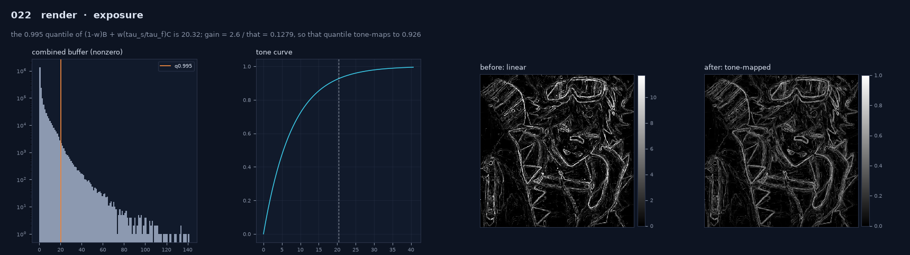

The raw ink buffer has no natural brightness scale. Most pixels hold almost no ink, and a few hold a great deal: the histogram runs from 0 past 140 on a logarithmic count axis.

The program converts ink to brightness with the curve **brightness = 1 − e^(−gain × ink)**. It behaves like ink soaking into paper: the first bit of ink darkens (here, brightens) a lot, and each extra bit adds less, approaching but never passing full intensity. Heavy overlaps are compressed gracefully instead of clipping to a flat white.

The gain is chosen automatically. The program finds the ink level that only 0.5% of pixels exceed (20.32 here) and picks the gain so that level maps to 92.6% brightness. That gives gain = 2.6 ÷ 20.32 = **0.128**. The before/after panels show the effect: the linear view is dominated by a few hot spots, while the tone-mapped view brings out the full range of line weights.

### 023 · Shrinking to output size

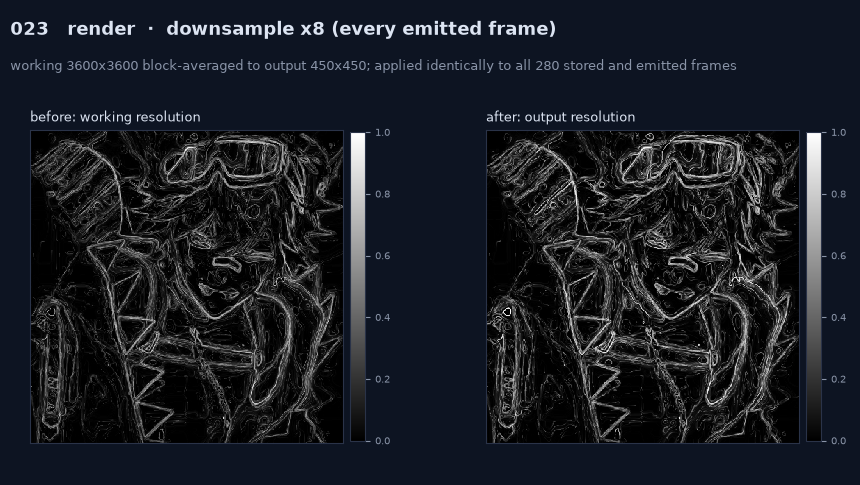

The 3600 × 3600 working canvas is shrunk to 450 × 450 by averaging every 8 × 8 block of pixels. This is where the 16× enlargement from step 002 pays off: lines thinner than an output pixel become soft, partially-lit pixels instead of jagged on/off dots. The same shrinking is applied to all 280 frames that will be kept or blended.

### 024 · Simulation A: the first 140 recorded frames

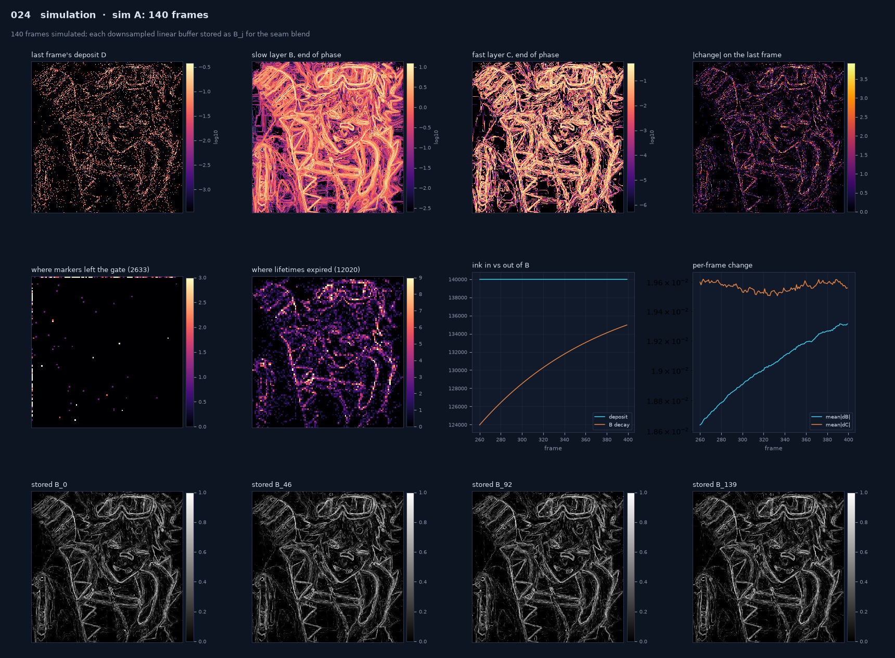

The next 140 frames are simulated, and each one is shrunk and saved in its raw ink form, before brightness conversion. These saved frames are needed for the seamless loop in Part 9.

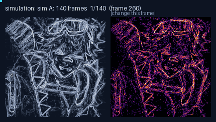

The "ink in vs. out" chart continues where the warm-up left off, with fading loss rising from about 124,000 to 135,000 per frame. The bottom row shows four of the saved frames (0, 46, 92, 139). They look almost identical at this size, because the slow layer barely changes over 7 seconds. The differences are in the thin travelling pulses from the fast layer. During this phase 2,633 markers walked off the edges and 12,020 reached the end of their lifetime and were reborn.

### 025 · The still image

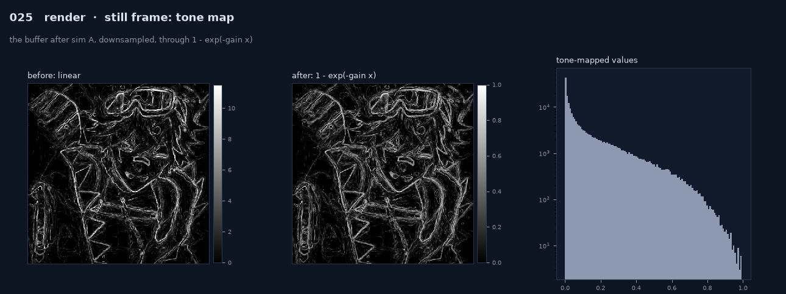

The buffer at the end of Simulation A is shrunk and passed through the brightness curve to make the still image. The histogram of brightness values shows most pixels near zero (the dark background) with a long tail toward full brightness (the strokes).

---

## Part 9 — Making a seamless loop

### The problem

If you record 140 frames of a simulation and play them on repeat, the jump from the last frame back to the first is obvious. Markers teleport and pulses vanish, because frame 140 and frame 1 are simply unrelated moments.

### The solution

The program simulates **140 more frames** (Simulation B) and *crossfades* each of them with the matching saved frame from Simulation A:

> output frame *j* = (1 − a) × late frame *j* + a × early frame *j*

Here "late" is Simulation B's frame, "early" is Simulation A's saved frame, and the blend weight **a** rises from 0 at the start of the loop to 1 at the end.

The reason that closes the loop is because at the *end* of the output (j = 139), a = 1, so the output is exactly early frame 139. At the *start* (j = 0), a = 0, so the output is exactly late frame 0, which in the simulation came immediately after early frame 139. So when the GIF wraps from its last frame to its first, the viewer sees one ordinary simulation step, no different from any other.

Two details make it look right:

- **The blend weight follows a smooth S-curve** (a "smootherstep", 6t⁵ − 15t⁴ + 10t³), not a straight line. It starts and ends not just at the right value but perfectly flat, so there's no sudden change in the *rate* of fading either.
- **Blending happens on the raw ink values, before brightness conversion.** Mixing two amounts of ink is physically meaningful (it's just less of one and more of the other), so that's the right place to blend. The brightness curve is applied afterwards.

### 026 · Brightness and colour for every output frame

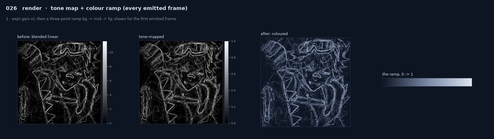

For each output frame, the blended ink goes through the brightness curve, then through a three-point **colour ramp**: dark navy (13, 20, 34) at zero brightness, slate blue-grey (120, 136, 164) at half, and pale blue-white (220, 228, 242) at full. This is shown for the first output frame.

### 027 · Simulation B and the crossfade

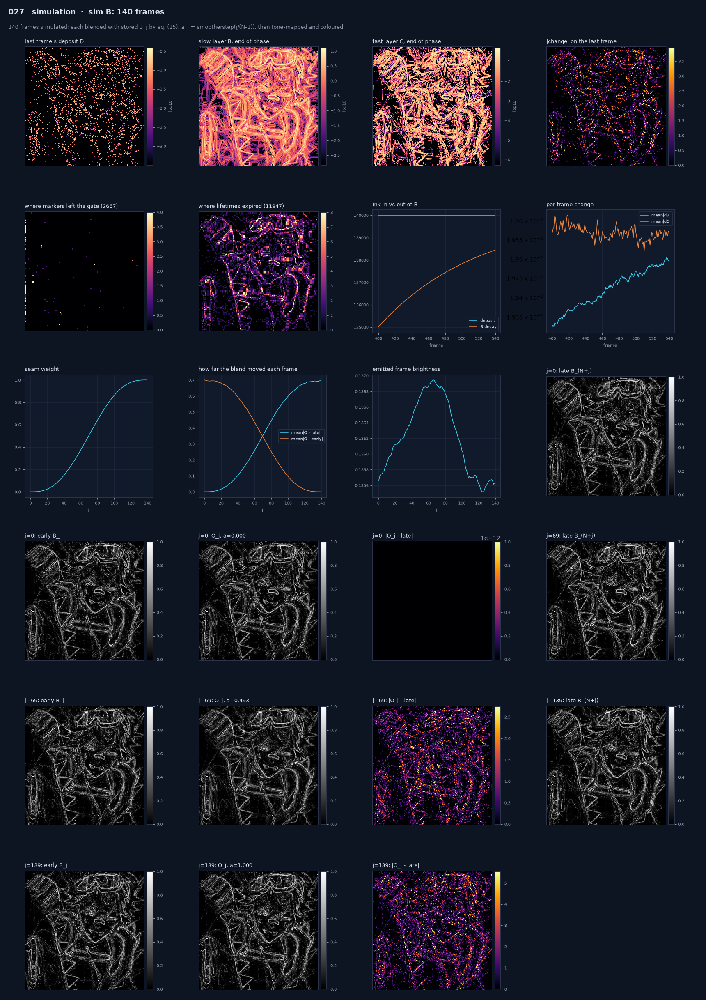

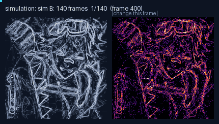

This is the largest trace graphic, and it documents the loop construction in detail.

**Top two rows** have the same layout as Simulation A. The fading loss continues climbing from about 135,000 toward 138,500 per frame, so by the end the slow layer is about 99% of the way to balance.

**Third row:**

- **Seam weight** is the S-curve for *a*, flat at both ends.
- **How far the blend moved each frame** shows two mirror-image curves. At the start, the output equals the late frame (blue at zero) and is far from the early one; by the end it's the reverse. They cross at the midpoint.
- **Emitted frame brightness** rises slightly in the middle of the loop, from about 0.1356 to 0.1370, roughly 1%. That's a side effect of blending: halfway through, each frame is an average of two drawings whose pulses sit in different places, so the ink is spread more evenly. The brightness curve rewards spreading (half the ink in a pixel gives more than half the brightness), so the average frame gets marginally brighter. It's small enough not to be noticeable.

**The remaining panels** show three moments: j = 0, 69 and 139. For each there's the late frame, the early frame, the blended output, and the difference between output and late frame. At j = 0 that difference is exactly zero (the colour bar reads 10⁻¹²). At j = 69 the output is a genuine half-and-half mix. At j = 139 the difference is largest, because the output has fully become the early frame. The differences are thin and speckled, showing the travelling pulses in different positions, while the underlying drawing is the same.

### Did it work?

The program measures this directly, and the result is in `measurements.json`. The average change between the last and first frames of the GIF is **0.0176**. The average change between any two consecutive frames inside the loop is **0.0168**. Their ratio is **1.05**, so the wrap-around is essentially indistinguishable from an ordinary frame step.

One honest caveat: step 021 showed that the warm-up got the slow layer only about 89% of the way to balance, and it was still gently filling in through both simulations (the average slow-layer value rose from 1.15 to 1.29 across them). A longer warm-up would make the loop even more exact. At a seam ratio of 1.05, though, the effect isn't visible.

---

## Part 10 — Colour and GIF

### 028 · Writing the still image

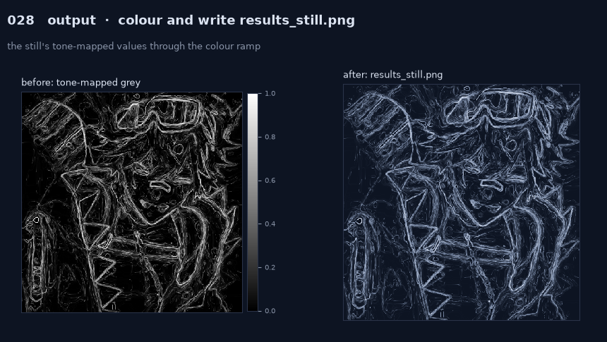

The still from step 025 is passed through the same colour ramp and saved as `results_still.png`:

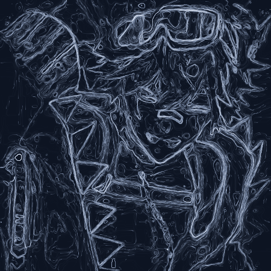

### 029 · Choosing 32 colours

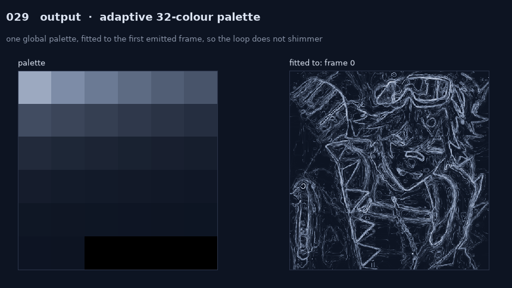

The GIF format allows at most 256 colours per frame; this run uses 32 to keep the file smaller. The palette is fitted once to the first output frame and then **reused for every frame**. If each frame got its own palette, a given shade of blue might map to slightly different colours from frame to frame, and the whole animation would shimmer.

An adaptive palette spends its slots where the pixels are, and most pixels are dark background. So most entries are dark navy shades, and only 26 of the 32 slots ended up holding distinct colours (the remaining entries are unused black). The brightest colour in the palette is (156, 169, 192), well short of the ramp's pale top end (220, 228, 242), because very few pixels are that bright. The brightest highlights therefore get pulled down a little, which is where the largest errors in the next step come from.

### 030 · Converting and writing the GIF

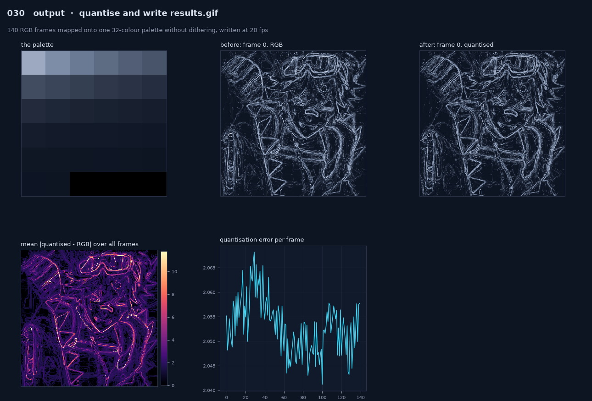

Each of the 140 frames is converted to the 32-colour palette by snapping every pixel to its nearest palette colour. **No dithering** is used. Dithering scatters patterns of dots to fake in-between colours, and those patterns would change from frame to frame, again causing shimmer.

The cost of snapping is small. The average colour error is about **2.05 levels out of 255** per channel, and it stays between 2.04 and 2.07 on every frame (bottom-right chart), so there's no flicker in quality. About 78% of pixels shift slightly; the largest single shift was 62 levels. The error map shows it concentrated on the bright strokes, where the palette from step 029 has few entries and none as bright as the brightest highlights. The frames are written at 20 frames per second, giving a 7-second loop in an 11.4 MB file:

---

## Everything together

The program's last output puts the process and the result side by side: the four structure panels from Part 5 on the left, and the animation on the right. It uses a larger 128-colour palette so the thin orange and cyan marks in the panels survive.

---

## Appendix A — Key numbers from this run

| Quantity | Value |
|---|---|
| Source → working → output size | 225² → 3600² → 450² pixels |
| Blur width (lightness / colour) | 7.2 / 21.6 working pixels |
| Share of edge information (L / a / b) | ≈ 63% / 11% / 26% |
| Average coherence | 0.85 |
| Defects found (at 32-px loops) | 1,212: 608 wedges (+½), 604 trisectors (−½) |
| Defects in the weaker half of the image | 67% |
| Defect count across loop sizes 1–16 px | 5,957 → 2,676 |
| Canvas open to markers | 99.0% |
| Ink dabs per frame | 140,000 |
| Frames simulated | 260 warm-up + 140 + 140 = 540 |
| Exposure gain | 0.128 |
| Loop seam ratio (1.0 = invisible) | 1.05 |
| GIF colour error | ≈ 2.05 / 255 per channel |
| GIF | 140 frames, 20 fps, 11.4 MB |

## Appendix B — What it costs

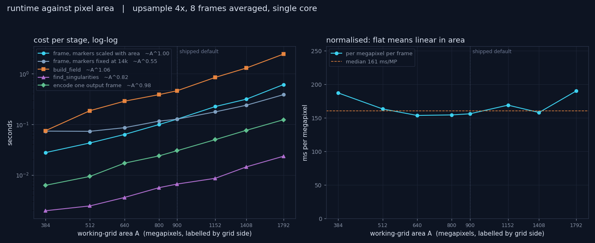

This chart shows the runtime vs area cost and was measured at the default 4× enlargement on a single CPU core. Every major stage scales almost exactly with the **area** of the working canvas (the right panel stays flat at about 160 ms per megapixel per frame). The number of markers barely matters, because all 14,000 are moved together in one vectorised operation.

This run used a 16× enlargement, which means a canvas 16 times larger in area than the default. According to the timings saved in the trace, the whole traced run took about **58 minutes**, and the 260-frame warm-up alone took about 32 minutes. Tracing itself adds roughly 50% overhead.

## Appendix C — Glossary

**Coherence** — How clearly one direction dominates at a pixel, from 0 (none) to 1 (a perfectly clean edge).

**CIELAB** — A colour space with separate lightness (L\*), green–red (a\*) and blue–yellow (b\*) channels, designed so equal numeric differences look roughly equally different to people.

**Defect / singularity** — A point where the line direction can't be defined consistently. Walking around it, the direction turns by half a revolution (+½ wedge or −½ trisector).

**Derivative of Gaussian** — A single operation that blurs and measures slope together; its width σ controls whether fine texture or broad shape is picked up.

**Gradient** — The direction and steepness of change at a point, like the uphill direction on a slope.

**λ₊ / λ₋** — The strength of change across and along the local edge.

**Line field** — A direction at every point with no preferred "forward" end, so angles are only meaningful up to 180°.

**Midpoint rule** — A way of tracing a path in small steps that looks ahead half a step before committing, which avoids slow drift off course.

**Quantisation** — Reducing an image to a limited palette of colours, as the GIF format requires.

**Structure tensor** — Three numbers per pixel (E, F, G) that summarise how much the image changes and along which axis, combining several channels without opposite slopes cancelling.

**Tone mapping** — Converting raw ink amounts into displayable brightness with a curve that compresses heavy overlaps.
